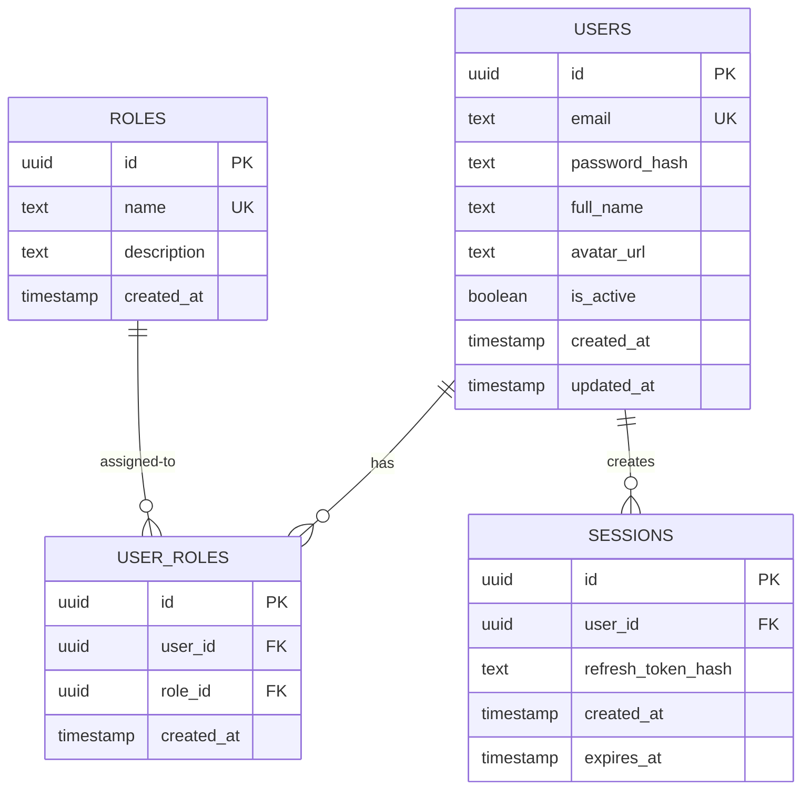

# Database

```mermaid
erDiagram

    USERS {
        uuid id PK
        text email UK
        text password_hash
        text full_name
        text avatar_url
        boolean is_active
        timestamp created_at
        timestamp updated_at
    }

    ROLES {
        uuid id PK
        text name UK
        text description
        timestamp created_at
    }

    USER_ROLES {
        uuid id PK
        uuid user_id FK
        uuid role_id FK
        timestamp created_at
    }

    SESSIONS {
        uuid id PK
        uuid user_id FK
        text refresh_token_hash
        timestamp created_at
        timestamp expires_at
    }

    USERS ||--o{ USER_ROLES : "has"
    ROLES ||--o{ USER_ROLES : "assigned-to"
    USERS ||--o{ SESSIONS : "creates"

```
