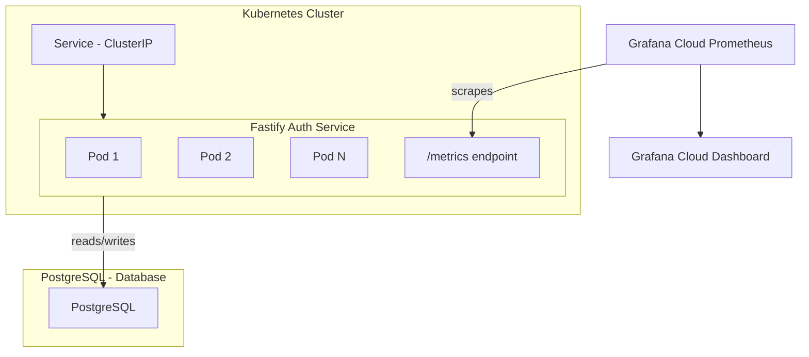
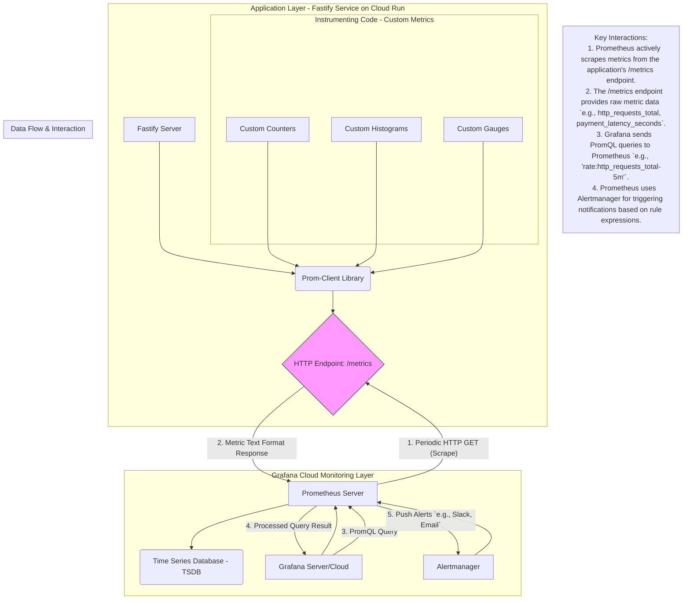

# Cloud Infrastructure Overview

## Architecture Overview

```mermaid
graph TD
    subgraph K8s[Kubernetes Cluster]
        svc[Service - ClusterIP]
        subgraph Fastify[Fastify Auth Service]
            pod1[Pod 1]
            pod2[Pod 2]
            podN[Pod N]
            metrics[ /metrics endpoint]
        end
    end

    svc --> Fastify
    Prom[Grafana Cloud Prometheus] -->|scrapes| metrics
    Prom --> Grafana[Grafana Cloud Dashboard]

    subgraph DB[PostgreSQL - Database]
        db[PostgreSQL]
    end

    Fastify -->|reads/writes| db
```
## Monitoring

```mermaid
graph TD
    %% Define the Subsystems
    subgraph Application Layer - Fastify Service on Cloud Run
        A[Fastify Server] --> B(Prom-Client Library);
        B --> C{HTTP Endpoint: /metrics};
        style C fill:#f9f,stroke:#333;
        subgraph Instrumenting Code - Custom Metrics
            B1[Custom Counters]
            B2[Custom Histograms]
            B3[Custom Gauges]
        end
        B1 & B2 & B3 --> B;
    end

    subgraph Grafana Cloud Monitoring Layer
        D[Prometheus Server] --> E(Time Series Database - TSDB);
        F[Grafana Server/Cloud] --> D;
        G[Alertmanager] --> D;
    end

    %% Define the Data Flow and Interactions
    subgraph Data Flow & Interaction
        direction LR
        D -- 1. Periodic HTTP GET (Scrape) --> C;
        C -- 2. Metric Text Format Response --> D;
        F -- 3. PromQL Query --> D;
        D -- 4. Processed Query Result --> F;
        D -- 5. Push Alerts `e.g., Slack, Email` --> G;
    end

    %% Add notes for clarity
    note[Key Interactions:
    1. Prometheus actively scrapes metrics from the application's /metrics endpoint.
    2. The /metrics endpoint provides raw metric data `e.g., http_requests_total, payment_latency_seconds`.
    3. Grafana sends PromQL queries to Prometheus `e.g., 'rate:http_requests_total-5m'`.
    4. Prometheus uses Alertmanager for triggering notifications based on rule expressions.]
```